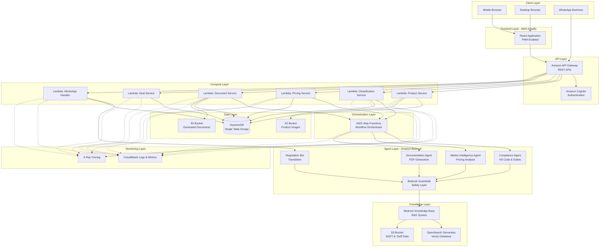
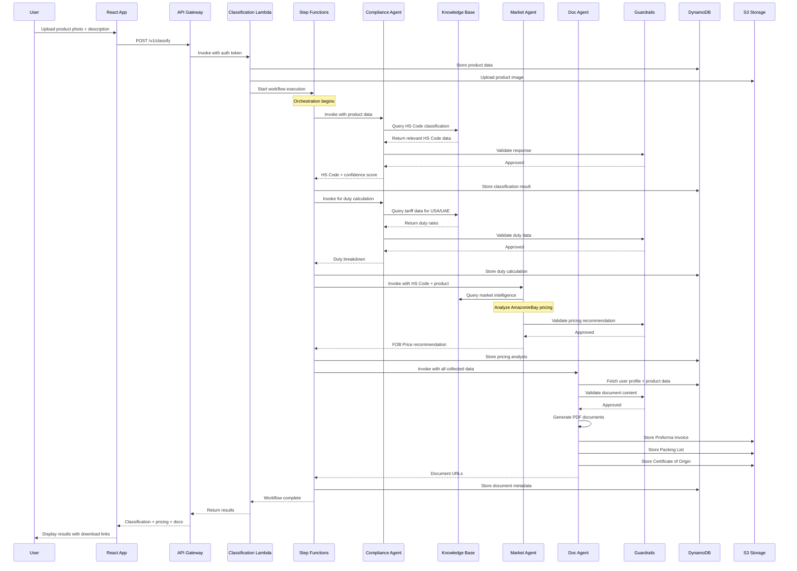

# Design Document: NiryatSetu

## Overview

NiryatSetu is a serverless, AI-powered export management platform built on AWS that enables Indian MSMEs to navigate the complexities of international trade. The system employs a multi-agent architecture where specialized Amazon Bedrock Agents handle distinct aspects of the export workflow: compliance classification, market intelligence, and documentation generation.

The platform is designed with a mobile-first approach, leveraging AWS serverless services for automatic scaling and cost efficiency. The architecture follows cloud-native best practices with infrastructure-as-code, comprehensive monitoring, and security-first design principles.

### Key Design Principles

1. **Serverless-First**: Utilize AWS Lambda, DynamoDB, and Bedrock to eliminate server management and enable automatic scaling
2. **Agent Specialization**: Each Bedrock Agent focuses on a single domain (compliance, pricing, documentation) for optimal accuracy
3. **RAG-Powered Intelligence**: All agents leverage Amazon Bedrock Knowledge Base with RAG to ground responses in authoritative data
4. **Orchestrated Workflows**: AWS Step Functions coordinates multi-agent interactions with built-in retry and error handling
5. **Mobile-Optimized**: React frontend designed for mobile-first experience with progressive web app capabilities
6. **Security by Design**: Amazon Bedrock Guardrails prevent hallucinations; encryption at rest and in transit; least-privilege IAM
7. **Cost-Conscious**: Amazon Nova Micro model selection to stay within AWS Free Tier; on-demand pricing for variable workloads

## Architecture

### High-Level System Architecture



### Multi-Agent Workflow Sequence




## Components and Interfaces

### Frontend Components

#### React Application Architecture

The frontend is built as a Progressive Web App (PWA) using React with the following component structure:

**Core Components:**

1. **App Shell** (`App.tsx`)
   - Handles routing, authentication state, and global error boundaries
   - Implements service worker for offline functionality
   - Manages theme and language context

2. **Authentication Module** (`auth/`)
   - `LoginPage.tsx`: Email/password login with MFA support
   - `RegisterPage.tsx`: Multi-step registration with GSTIN/IEC validation
   - `PasswordReset.tsx`: Email-based password recovery
   - Uses AWS Amplify Auth library for Cognito integration

3. **Dashboard Module** (`dashboard/`)
   - `DashboardHome.tsx`: Overview with key metrics and recent activity
   - `ProductCatalog.tsx`: Grid/list view of products with search and filters
   - `DealPipeline.tsx`: Kanban board for deal flow management
   - `Analytics.tsx`: Charts showing export performance metrics

4. **Product Management Module** (`products/`)
   - `ProductForm.tsx`: Multi-step form for adding/editing products
   - `ProductDetail.tsx`: Detailed view with classification and pricing
   - `ImageUpload.tsx`: Camera capture and gallery selection with preview
   - `BulkUpload.tsx`: CSV upload with validation and error reporting

5. **Classification Module** (`classification/`)
   - `ClassificationRequest.tsx`: Interface for initiating classification
   - `HSCodeDisplay.tsx`: Visual display of HS Code with explanation
   - `DutyBreakdown.tsx`: Interactive breakdown of import duties
   - `ConfidenceIndicator.tsx`: Visual confidence score display

6. **Pricing Module** (`pricing/`)
   - `PricingAnalysis.tsx`: Display of market intelligence results
   - `CompetitorComparison.tsx`: Table comparing competitor prices
   - `PriceRecommendation.tsx`: Visual recommendation with positioning
   - `PriceCalculator.tsx`: Interactive calculator for FOB price

7. **Documentation Module** (`documents/`)
   - `DocumentGenerator.tsx`: Form for document generation parameters
   - `DocumentPreview.tsx`: PDF preview with download options
   - `DocumentHistory.tsx`: List of previously generated documents
   - `BulkDownload.tsx`: ZIP download of multiple documents

8. **Negotiation Module** (`negotiation/`)
   - `ConversationList.tsx`: List of active buyer conversations
   - `ChatInterface.tsx`: WhatsApp-style chat UI with translations
   - `TranslationToggle.tsx`: Switch between original and translated text
   - `QuickReplies.tsx`: Common business phrases for quick responses

**Shared Components:**

- `LoadingSpinner.tsx`: Consistent loading indicators
- `ErrorBoundary.tsx`: Graceful error handling with retry
- `Toast.tsx`: Notification system for success/error messages
- `Modal.tsx`: Reusable modal dialog component
- `LanguageSelector.tsx`: Dropdown for UI language selection

**State Management:**

- React Context API for global state (auth, language, theme)
- React Query for server state management and caching
- Local state with useState/useReducer for component-specific state

**API Integration:**

```typescript
// API Client Interface
interface APIClient {
  // Product APIs
  createProduct(data: ProductInput): Promise<Product>;
  updateProduct(id: string, data: ProductInput): Promise<Product>;
  getProduct(id: string): Promise<Product>;
  listProducts(filters: ProductFilters): Promise<PaginatedResponse<Product>>;
  deleteProduct(id: string): Promise<void>;
  
  // Classification APIs
  classifyProduct(productId: string, targetCountry: Country): Promise<Classification>;
  getClassificationHistory(productId: string): Promise<Classification[]>;
  
  // Pricing APIs
  analyzePricing(productId: string, hsCode: string): Promise<PricingAnalysis>;
  
  // Document APIs
  generateDocuments(dealId: string, documentTypes: DocumentType[]): Promise<DocumentSet>;
  getDocument(documentId: string): Promise<Document>;
  downloadDocuments(documentIds: string[]): Promise<Blob>;
  
  // Deal APIs
  createDeal(data: DealInput): Promise<Deal>;
  updateDealStatus(dealId: string, status: DealStatus): Promise<Deal>;
  listDeals(filters: DealFilters): Promise<PaginatedResponse<Deal>>;
  
  // User APIs
  getUserProfile(): Promise<UserProfile>;
  updateUserProfile(data: ProfileUpdate): Promise<UserProfile>;
}
```

### Backend Services

#### API Gateway Configuration

**REST API Structure:**

```
/v1
  /auth
    POST /register
    POST /login
    POST /logout
    POST /refresh-token
    POST /reset-password
    POST /verify-email
  
  /users
    GET /profile
    PUT /profile
    POST /profile/avatar
  
  /products
    POST /
    GET /{productId}
    PUT /{productId}
    DELETE /{productId}
    GET /
    POST /bulk-upload
  
  /classification
    POST /classify
    GET /{classificationId}
    GET /products/{productId}/history
  
  /pricing
    POST /analyze
    GET /{analysisId}
  
  /documents
    POST /generate
    GET /{documentId}
    GET /{documentId}/download
    POST /bulk-download
  
  /deals
    POST /
    GET /{dealId}
    PUT /{dealId}
    GET /
    PUT /{dealId}/status
  
  /webhooks
    POST /whatsapp
```

**API Gateway Features:**

- Request validation using JSON Schema
- Rate limiting: 100 req/min (standard), 500 req/min (enterprise)
- API key authentication for webhook endpoints
- CORS configuration for frontend domain
- Request/response transformation
- CloudWatch logging with correlation IDs
- X-Ray tracing enabled

#### Lambda Functions

**1. Product Service Lambda**

```typescript
// Handler: products/handler.ts
interface ProductServiceEvent {
  httpMethod: string;
  path: string;
  pathParameters?: { productId?: string };
  body?: string;
  queryStringParameters?: Record<string, string>;
  requestContext: { authorizer: { userId: string } };
}

async function handler(event: ProductServiceEvent): Promise<APIResponse> {
  const userId = event.requestContext.authorizer.userId;
  
  switch (event.httpMethod) {
    case 'POST':
      return await createProduct(userId, JSON.parse(event.body));
    case 'GET':
      if (event.pathParameters?.productId) {
        return await getProduct(userId, event.pathParameters.productId);
      }
      return await listProducts(userId, event.queryStringParameters);
    case 'PUT':
      return await updateProduct(userId, event.pathParameters.productId, JSON.parse(event.body));
    case 'DELETE':
      return await deleteProduct(userId, event.pathParameters.productId);
  }
}

// DynamoDB Operations
async function createProduct(userId: string, data: ProductInput): Promise<Product> {
  const productId = generateId();
  const timestamp = Date.now();
  
  const item = {
    PK: `USER#${userId}`,
    SK: `PRODUCT#${productId}`,
    GSI1PK: `PRODUCT#${productId}`,
    GSI1SK: `METADATA`,
    EntityType: 'Product',
    ProductId: productId,
    UserId: userId,
    Name: data.name,
    Description: data.description,
    Category: data.category,
    BasePrice: data.basePrice,
    Images: data.images,
    CreatedAt: timestamp,
    UpdatedAt: timestamp,
    Status: 'Active'
  };
  
  await dynamodb.put({ TableName: TABLE_NAME, Item: item }).promise();
  return mapToProduct(item);
}
```

**2. Classification Service Lambda**

```typescript
// Handler: classification/handler.ts
async function classifyProduct(event: ClassificationEvent): Promise<APIResponse> {
  const { productId, targetCountry } = JSON.parse(event.body);
  const userId = event.requestContext.authorizer.userId;
  
  // Fetch product data
  const product = await getProduct(userId, productId);
  
  // Start Step Functions workflow
  const executionArn = await stepFunctions.startExecution({
    stateMachineArn: CLASSIFICATION_STATE_MACHINE_ARN,
    input: JSON.stringify({
      userId,
      productId,
      productName: product.Name,
      productDescription: product.Description,
      productImages: product.Images,
      targetCountry,
      timestamp: Date.now()
    })
  }).promise();
  
  // Store workflow execution reference
  await dynamodb.put({
    TableName: TABLE_NAME,
    Item: {
      PK: `USER#${userId}`,
      SK: `CLASSIFICATION#${executionArn.executionArn}`,
      GSI1PK: `PRODUCT#${productId}`,
      GSI1SK: `CLASSIFICATION#${Date.now()}`,
      EntityType: 'Classification',
      ProductId: productId,
      ExecutionArn: executionArn.executionArn,
      Status: 'InProgress',
      TargetCountry: targetCountry,
      CreatedAt: Date.now()
    }
  }).promise();
  
  return {
    statusCode: 202,
    body: JSON.stringify({
      executionArn: executionArn.executionArn,
      status: 'InProgress',
      message: 'Classification workflow started'
    })
  };
}
```

**3. Document Service Lambda**

```typescript
// Handler: documents/handler.ts
async function generateDocuments(event: DocumentEvent): Promise<APIResponse> {
  const { dealId, documentTypes } = JSON.parse(event.body);
  const userId = event.requestContext.authorizer.userId;
  
  // Fetch deal data
  const deal = await getDeal(userId, dealId);
  
  // Start Step Functions workflow for document generation
  const executionArn = await stepFunctions.startExecution({
    stateMachineArn: DOCUMENT_STATE_MACHINE_ARN,
    input: JSON.stringify({
      userId,
      dealId,
      documentTypes,
      dealData: deal,
      timestamp: Date.now()
    })
  }).promise();
  
  return {
    statusCode: 202,
    body: JSON.stringify({
      executionArn: executionArn.executionArn,
      status: 'Generating',
      message: 'Document generation started'
    })
  };
}
```

**4. WhatsApp Handler Lambda**

```typescript
// Handler: whatsapp/handler.ts
async function handleWhatsAppWebhook(event: WebhookEvent): Promise<APIResponse> {
  const payload = JSON.parse(event.body);
  
  // Verify webhook signature
  if (!verifyWhatsAppSignature(payload, event.headers['x-hub-signature'])) {
    return { statusCode: 401, body: 'Invalid signature' };
  }
  
  // Extract message data
  const message = payload.entry[0].changes[0].value.messages[0];
  const from = message.from;
  const text = message.text.body;
  
  // Find associated deal/user
  const conversation = await findConversation(from);
  
  // Invoke Negotiation Bot for translation
  const translatedText = await invokeNegotiationBot({
    text,
    sourceLanguage: 'auto',
    targetLanguage: conversation.userLanguage,
    conversationContext: conversation.history
  });
  
  // Store message in DynamoDB
  await storeMessage({
    conversationId: conversation.id,
    from,
    originalText: text,
    translatedText,
    timestamp: Date.now()
  });
  
  // Send notification to user
  await sendNotification(conversation.userId, {
    type: 'NewMessage',
    message: translatedText
  });
  
  return { statusCode: 200, body: 'OK' };
}
```


### Amazon Bedrock Agents

#### Agent Configuration

All agents use **Amazon Nova Micro** model to stay within AWS Free Tier limits while maintaining good performance for text-based tasks.

**Common Agent Configuration:**

```json
{
  "modelId": "amazon.nova-micro-v1:0",
  "temperature": 0.1,
  "topP": 0.9,
  "maxTokens": 2048,
  "stopSequences": ["</response>"],
  "guardrailId": "niryatsetu-guardrail-v1",
  "guardrailVersion": "1"
}
```

#### 1. Compliance Agent

**Purpose:** Classify products into correct HS Codes and calculate import duties.

**Agent Instructions:**

```
You are a trade compliance expert specializing in HS Code classification and import duty calculation for Indian exports.

Your responsibilities:
1. Analyze product descriptions and images to determine the correct 6-digit international HS Code and 8-digit country-specific code
2. Calculate import duties for USA and UAE markets including all applicable tariffs and taxes
3. Provide confidence scores for your classifications
4. Explain your reasoning in simple business language

Guidelines:
- Always query the Knowledge Base for authoritative HS Code and tariff data
- If multiple HS Codes are possible, present up to 3 options ranked by confidence
- Consider product material, intended use, and manufacturing process in classification
- Include any applicable Free Trade Agreement benefits in duty calculations
- Never fabricate HS Codes or duty rates - always ground responses in Knowledge Base data

Output format:
{
  "hsCode": "6-digit code",
  "hsCodeExtended": "8-digit country-specific code",
  "description": "HS Code description",
  "confidence": 0-100,
  "reasoning": "explanation",
  "alternatives": [{"hsCode": "...", "confidence": 0-100}],
  "duties": {
    "country": "USA or UAE",
    "baseTariff": percentage,
    "additionalDuties": percentage,
    "totalDuty": percentage,
    "ftaBenefit": boolean
  }
}
```

**Action Groups:**

1. **QueryHSCodeDatabase**
   - Function: `searchHSCode(productDescription: string, productCategory: string)`
   - Returns: List of potential HS Codes with descriptions

2. **QueryTariffDatabase**
   - Function: `getTariffRate(hsCode: string, country: string)`
   - Returns: Duty rates and tax information

**Knowledge Base Integration:**

- Queries vector database for semantic search of HS Code descriptions
- Retrieves exact tariff schedules for USA (HTSUS) and UAE (UAE Customs Tariff)
- Accesses DGFT trade policy for Indian export regulations

#### 2. Market Intelligence Agent

**Purpose:** Analyze global market pricing and recommend optimal export prices.

**Agent Instructions:**

```
You are a market intelligence analyst specializing in global e-commerce pricing for Indian exports.

Your responsibilities:
1. Analyze competitor pricing on Amazon.com and eBay for similar products
2. Calculate optimal FOB (Free On Board) price in Indian Rupees
3. Consider import duties, shipping costs, and target profit margins
4. Provide price positioning recommendations (budget/mid-range/premium)

Guidelines:
- Query the Knowledge Base for recent market data and competitor pricing
- Identify at least 10 comparable products for robust analysis
- Calculate: min, max, median, and recommended prices
- Ensure minimum 20% profit margin in recommendations
- Convert all prices to INR using current exchange rates
- Consider seasonal demand patterns and market trends

Output format:
{
  "recommendedFOBPrice": amount in INR,
  "priceRange": {"min": INR, "max": INR, "median": INR},
  "positioning": "budget|mid-range|premium",
  "confidence": 0-100,
  "competitorCount": number,
  "marketInsights": "analysis summary",
  "profitMargin": percentage,
  "exchangeRate": USD to INR rate
}
```

**Action Groups:**

1. **QueryMarketData**
   - Function: `searchCompetitorPrices(productName: string, hsCode: string, marketplace: string)`
   - Returns: List of competitor products with prices

2. **GetExchangeRates**
   - Function: `getCurrentExchangeRate(fromCurrency: string, toCurrency: string)`
   - Returns: Current exchange rate

**Knowledge Base Integration:**

- Accesses scraped marketplace data (Amazon.com, eBay)
- Retrieves historical pricing trends
- Accesses shipping cost databases

#### 3. Documentation Agent

**Purpose:** Generate legally compliant export documents in PDF format.

**Agent Instructions:**

```
You are an export documentation specialist creating legally compliant trade documents for Indian MSMEs.

Your responsibilities:
1. Generate Proforma Invoices with all required fields
2. Generate Packing Lists with accurate product details
3. Generate Certificates of Origin compliant with target country requirements
4. Ensure all documents follow international trade standards

Guidelines:
- Use document templates appropriate for target country (USA/UAE)
- Populate all mandatory fields from provided data
- Include proper legal disclaimers and terms
- Format currency amounts in both USD and INR
- Generate unique document reference numbers
- Never fabricate information - only use provided data
- If required data is missing, list the missing fields clearly

Output format:
{
  "documents": [
    {
      "type": "ProformaInvoice|PackingList|CertificateOfOrigin",
      "documentId": "unique ID",
      "pdfContent": "base64 encoded PDF",
      "metadata": {
        "documentNumber": "reference number",
        "issueDate": "ISO date",
        "expiryDate": "ISO date if applicable"
      }
    }
  ],
  "missingFields": ["list of missing required fields"],
  "warnings": ["any compliance warnings"]
}
```

**Action Groups:**

1. **GeneratePDF**
   - Function: `createPDF(template: string, data: object)`
   - Returns: Base64 encoded PDF

2. **ValidateDocumentData**
   - Function: `validateRequiredFields(documentType: string, data: object)`
   - Returns: Validation result with missing fields

**Knowledge Base Integration:**

- Accesses document templates and legal requirements
- Retrieves country-specific compliance rules
- Accesses Incoterms definitions and trade terms

#### 4. Negotiation Bot

**Purpose:** Provide real-time multilingual translation for buyer-seller negotiations.

**Agent Instructions:**

```
You are a business negotiation translator specializing in international trade communications.

Your responsibilities:
1. Translate messages between English/Spanish and Hindi/Tamil
2. Maintain business-appropriate tone and terminology
3. Preserve product names, technical terms, and numbers accurately
4. Provide context-aware translations considering negotiation history

Guidelines:
- Detect source language automatically
- Use formal business language in all translations
- Preserve pricing, quantities, and dates exactly
- Maintain conversation context across multiple exchanges
- Flag low-confidence translations for review
- Never add or remove information - translate faithfully

Output format:
{
  "translatedText": "translated message",
  "sourceLanguage": "detected language",
  "targetLanguage": "requested language",
  "confidence": 0-100,
  "preservedTerms": ["list of untranslated technical terms"],
  "needsReview": boolean
}
```

**Action Groups:**

1. **TranslateText**
   - Function: `translate(text: string, sourceLang: string, targetLang: string, context: string[])`
   - Returns: Translated text with confidence

2. **DetectLanguage**
   - Function: `detectLanguage(text: string)`
   - Returns: Detected language code

**Knowledge Base Integration:**

- Accesses business terminology glossaries
- Retrieves common negotiation phrases
- Accesses product-specific terminology databases

### Amazon Bedrock Guardrails

**Guardrail Configuration:**

```json
{
  "name": "NiryatSetuGuardrail",
  "description": "Prevents hallucinated legal advice and ensures data privacy",
  "blockedInputMessaging": "I cannot process this request as it may contain inappropriate content.",
  "blockedOutputsMessaging": "I cannot provide this information as it may not be accurate. Please consult official sources.",
  
  "contentPolicyConfig": {
    "filtersConfig": [
      {
        "type": "SEXUAL",
        "inputStrength": "HIGH",
        "outputStrength": "HIGH"
      },
      {
        "type": "VIOLENCE",
        "inputStrength": "HIGH",
        "outputStrength": "HIGH"
      },
      {
        "type": "HATE",
        "inputStrength": "HIGH",
        "outputStrength": "HIGH"
      },
      {
        "type": "INSULTS",
        "inputStrength": "MEDIUM",
        "outputStrength": "MEDIUM"
      },
      {
        "type": "MISCONDUCT",
        "inputStrength": "HIGH",
        "outputStrength": "HIGH"
      },
      {
        "type": "PROMPT_ATTACK",
        "inputStrength": "HIGH",
        "outputStrength": "NONE"
      }
    ]
  },
  
  "topicPolicyConfig": {
    "topicsConfig": [
      {
        "name": "FabricatedLegalAdvice",
        "definition": "Responses containing made-up legal requirements, fabricated duty rates, or invented compliance rules not grounded in the Knowledge Base",
        "examples": [
          "You must obtain a special permit from the Ministry of Commerce",
          "The import duty for this product is 15% (when not verified)",
          "Indian law requires all exporters to register with the Export Council"
        ],
        "type": "DENY"
      },
      {
        "name": "OtherUsersData",
        "definition": "Information about other users' business details, trade secrets, or confidential data",
        "examples": [
          "Another user exports similar products at this price",
          "User XYZ has the following business details"
        ],
        "type": "DENY"
      },
      {
        "name": "UnverifiedHSCodes",
        "definition": "HS Code classifications not validated against the Knowledge Base",
        "examples": [
          "I think the HS Code might be 1234.56",
          "Based on my general knowledge, use HS Code 7890.12"
        ],
        "type": "DENY"
      }
    ]
  },
  
  "wordPolicyConfig": {
    "wordsConfig": [
      {
        "text": "I'm not sure but"
      },
      {
        "text": "I think maybe"
      },
      {
        "text": "probably"
      },
      {
        "text": "might be"
      }
    ],
    "managedWordListsConfig": [
      {
        "type": "PROFANITY"
      }
    ]
  },
  
  "sensitiveInformationPolicyConfig": {
    "piiEntitiesConfig": [
      {
        "type": "EMAIL",
        "action": "ANONYMIZE"
      },
      {
        "type": "PHONE",
        "action": "ANONYMIZE"
      },
      {
        "type": "NAME",
        "action": "ANONYMIZE"
      },
      {
        "type": "ADDRESS",
        "action": "ANONYMIZE"
      }
    ],
    "regexesConfig": [
      {
        "name": "GSTIN",
        "description": "Indian GST Identification Number",
        "pattern": "\\d{2}[A-Z]{5}\\d{4}[A-Z]{1}[A-Z\\d]{1}[Z]{1}[A-Z\\d]{1}",
        "action": "ANONYMIZE"
      },
      {
        "name": "IEC",
        "description": "Import Export Code",
        "pattern": "\\d{10}",
        "action": "ANONYMIZE"
      }
    ]
  }
}
```


### AWS Step Functions Workflows

#### Classification and Pricing Workflow

```json
{
  "Comment": "NiryatSetu Classification and Pricing Workflow",
  "StartAt": "ClassifyProduct",
  "States": {
    "ClassifyProduct": {
      "Type": "Task",
      "Resource": "arn:aws:states:::bedrock:invokeAgent",
      "Parameters": {
        "AgentId": "${ComplianceAgentId}",
        "AgentAliasId": "${ComplianceAgentAliasId}",
        "SessionId.$": "$.sessionId",
        "InputText.$": "States.Format('Classify this product: Name: {}, Description: {}, Category: {}, Target Country: {}', $.productName, $.productDescription, $.productCategory, $.targetCountry)"
      },
      "ResultPath": "$.classificationResult",
      "Retry": [
        {
          "ErrorEquals": ["States.TaskFailed"],
          "IntervalSeconds": 2,
          "MaxAttempts": 3,
          "BackoffRate": 2.0
        }
      ],
      "Catch": [
        {
          "ErrorEquals": ["States.ALL"],
          "ResultPath": "$.error",
          "Next": "ClassificationFailed"
        }
      ],
      "Next": "ParseClassification"
    },
    
    "ParseClassification": {
      "Type": "Pass",
      "Parameters": {
        "hsCode.$": "$.classificationResult.completion.hsCode",
        "confidence.$": "$.classificationResult.completion.confidence",
        "duties.$": "$.classificationResult.completion.duties"
      },
      "ResultPath": "$.parsedClassification",
      "Next": "StoreClassification"
    },
    
    "StoreClassification": {
      "Type": "Task",
      "Resource": "arn:aws:states:::dynamodb:putItem",
      "Parameters": {
        "TableName": "${TableName}",
        "Item": {
          "PK": {"S.$": "States.Format('USER#{}', $.userId)"},
          "SK": {"S.$": "States.Format('CLASSIFICATION#{}', $.timestamp)"},
          "GSI1PK": {"S.$": "States.Format('PRODUCT#{}', $.productId)"},
          "GSI1SK": {"S.$": "States.Format('CLASSIFICATION#{}', $.timestamp)"},
          "EntityType": {"S": "Classification"},
          "HSCode": {"S.$": "$.parsedClassification.hsCode"},
          "Confidence": {"N.$": "States.Format('{}', $.parsedClassification.confidence)"},
          "Duties": {"S.$": "States.JsonToString($.parsedClassification.duties)"},
          "TargetCountry": {"S.$": "$.targetCountry"},
          "CreatedAt": {"N.$": "States.Format('{}', $.timestamp)"}
        }
      },
      "ResultPath": "$.storeResult",
      "Next": "AnalyzePricing"
    },
    
    "AnalyzePricing": {
      "Type": "Task",
      "Resource": "arn:aws:states:::bedrock:invokeAgent",
      "Parameters": {
        "AgentId": "${MarketIntelligenceAgentId}",
        "AgentAliasId": "${MarketIntelligenceAgentAliasId}",
        "SessionId.$": "$.sessionId",
        "InputText.$": "States.Format('Analyze pricing for: Product: {}, HS Code: {}, Target Country: {}, Base Price: {} INR', $.productName, $.parsedClassification.hsCode, $.targetCountry, $.basePrice)"
      },
      "ResultPath": "$.pricingResult",
      "Retry": [
        {
          "ErrorEquals": ["States.TaskFailed"],
          "IntervalSeconds": 2,
          "MaxAttempts": 3,
          "BackoffRate": 2.0
        }
      ],
      "Catch": [
        {
          "ErrorEquals": ["States.ALL"],
          "ResultPath": "$.error",
          "Next": "PricingFailed"
        }
      ],
      "Next": "ParsePricing"
    },
    
    "ParsePricing": {
      "Type": "Pass",
      "Parameters": {
        "recommendedFOBPrice.$": "$.pricingResult.completion.recommendedFOBPrice",
        "priceRange.$": "$.pricingResult.completion.priceRange",
        "positioning.$": "$.pricingResult.completion.positioning",
        "confidence.$": "$.pricingResult.completion.confidence"
      },
      "ResultPath": "$.parsedPricing",
      "Next": "StorePricing"
    },
    
    "StorePricing": {
      "Type": "Task",
      "Resource": "arn:aws:states:::dynamodb:putItem",
      "Parameters": {
        "TableName": "${TableName}",
        "Item": {
          "PK": {"S.$": "States.Format('USER#{}', $.userId)"},
          "SK": {"S.$": "States.Format('PRICING#{}', $.timestamp)"},
          "GSI1PK": {"S.$": "States.Format('PRODUCT#{}', $.productId)"},
          "GSI1SK": {"S.$": "States.Format('PRICING#{}', $.timestamp)"},
          "EntityType": {"S": "PricingAnalysis"},
          "RecommendedPrice": {"N.$": "States.Format('{}', $.parsedPricing.recommendedFOBPrice)"},
          "PriceRange": {"S.$": "States.JsonToString($.parsedPricing.priceRange)"},
          "Positioning": {"S.$": "$.parsedPricing.positioning"},
          "Confidence": {"N.$": "States.Format('{}', $.parsedPricing.confidence)"},
          "CreatedAt": {"N.$": "States.Format('{}', $.timestamp)"}
        }
      },
      "ResultPath": "$.storePricingResult",
      "Next": "WorkflowSuccess"
    },
    
    "WorkflowSuccess": {
      "Type": "Succeed"
    },
    
    "ClassificationFailed": {
      "Type": "Task",
      "Resource": "arn:aws:states:::sns:publish",
      "Parameters": {
        "TopicArn": "${ErrorNotificationTopic}",
        "Subject": "Classification Workflow Failed",
        "Message.$": "States.Format('Classification failed for product {} with error: {}', $.productId, $.error)"
      },
      "Next": "WorkflowFailed"
    },
    
    "PricingFailed": {
      "Type": "Task",
      "Resource": "arn:aws:states:::sns:publish",
      "Parameters": {
        "TopicArn": "${ErrorNotificationTopic}",
        "Subject": "Pricing Analysis Failed",
        "Message.$": "States.Format('Pricing analysis failed for product {} with error: {}', $.productId, $.error)"
      },
      "Next": "WorkflowFailed"
    },
    
    "WorkflowFailed": {
      "Type": "Fail",
      "Error": "WorkflowExecutionFailed",
      "Cause": "One or more steps in the workflow failed"
    }
  }
}
```

#### Document Generation Workflow

```json
{
  "Comment": "NiryatSetu Document Generation Workflow",
  "StartAt": "FetchDealData",
  "States": {
    "FetchDealData": {
      "Type": "Task",
      "Resource": "arn:aws:states:::dynamodb:getItem",
      "Parameters": {
        "TableName": "${TableName}",
        "Key": {
          "PK": {"S.$": "States.Format('USER#{}', $.userId)"},
          "SK": {"S.$": "States.Format('DEAL#{}', $.dealId)"}
        }
      },
      "ResultPath": "$.dealData",
      "Next": "FetchUserProfile"
    },
    
    "FetchUserProfile": {
      "Type": "Task",
      "Resource": "arn:aws:states:::dynamodb:getItem",
      "Parameters": {
        "TableName": "${TableName}",
        "Key": {
          "PK": {"S.$": "States.Format('USER#{}', $.userId)"},
          "SK": {"S": "PROFILE"}
        }
      },
      "ResultPath": "$.userProfile",
      "Next": "GenerateDocuments"
    },
    
    "GenerateDocuments": {
      "Type": "Task",
      "Resource": "arn:aws:states:::bedrock:invokeAgent",
      "Parameters": {
        "AgentId": "${DocumentationAgentId}",
        "AgentAliasId": "${DocumentationAgentAliasId}",
        "SessionId.$": "$.sessionId",
        "InputText.$": "States.Format('Generate documents: Types: {}, Deal Data: {}, User Profile: {}', States.JsonToString($.documentTypes), States.JsonToString($.dealData.Item), States.JsonToString($.userProfile.Item))"
      },
      "ResultPath": "$.documentResult",
      "Retry": [
        {
          "ErrorEquals": ["States.TaskFailed"],
          "IntervalSeconds": 2,
          "MaxAttempts": 3,
          "BackoffRate": 2.0
        }
      ],
      "Catch": [
        {
          "ErrorEquals": ["States.ALL"],
          "ResultPath": "$.error",
          "Next": "DocumentGenerationFailed"
        }
      ],
      "Next": "ProcessDocuments"
    },
    
    "ProcessDocuments": {
      "Type": "Map",
      "ItemsPath": "$.documentResult.completion.documents",
      "MaxConcurrency": 3,
      "Iterator": {
        "StartAt": "UploadToS3",
        "States": {
          "UploadToS3": {
            "Type": "Task",
            "Resource": "arn:aws:states:::aws-sdk:s3:putObject",
            "Parameters": {
              "Bucket": "${DocumentsBucket}",
              "Key.$": "States.Format('{}/{}/{}.pdf', $.userId, $.dealId, $.documentId)",
              "Body.$": "$.pdfContent",
              "ContentType": "application/pdf",
              "ContentEncoding": "base64"
            },
            "ResultPath": "$.s3Result",
            "Next": "StoreDocumentMetadata"
          },
          
          "StoreDocumentMetadata": {
            "Type": "Task",
            "Resource": "arn:aws:states:::dynamodb:putItem",
            "Parameters": {
              "TableName": "${TableName}",
              "Item": {
                "PK": {"S.$": "States.Format('USER#{}', $.userId)"},
                "SK": {"S.$": "States.Format('DOCUMENT#{}', $.documentId)"},
                "GSI1PK": {"S.$": "States.Format('DEAL#{}', $.dealId)"},
                "GSI1SK": {"S.$": "States.Format('DOCUMENT#{}', $.metadata.issueDate)"},
                "EntityType": {"S": "Document"},
                "DocumentId": {"S.$": "$.documentId"},
                "DocumentType": {"S.$": "$.type"},
                "DocumentNumber": {"S.$": "$.metadata.documentNumber"},
                "S3Key": {"S.$": "$.s3Result.Key"},
                "IssueDate": {"S.$": "$.metadata.issueDate"},
                "CreatedAt": {"N.$": "States.Format('{}', $.timestamp)"}
              }
            },
            "End": true
          }
        }
      },
      "ResultPath": "$.processedDocuments",
      "Next": "UpdateDealStatus"
    },
    
    "UpdateDealStatus": {
      "Type": "Task",
      "Resource": "arn:aws:states:::dynamodb:updateItem",
      "Parameters": {
        "TableName": "${TableName}",
        "Key": {
          "PK": {"S.$": "States.Format('USER#{}', $.userId)"},
          "SK": {"S.$": "States.Format('DEAL#{}', $.dealId)"}
        },
        "UpdateExpression": "SET #status = :status, DocumentsGenerated = :docs, UpdatedAt = :timestamp",
        "ExpressionAttributeNames": {
          "#status": "Status"
        },
        "ExpressionAttributeValues": {
          ":status": {"S": "DocumentsGenerated"},
          ":docs": {"BOOL": true},
          ":timestamp": {"N.$": "States.Format('{}', $.timestamp)"}
        }
      },
      "ResultPath": "$.updateResult",
      "Next": "WorkflowSuccess"
    },
    
    "WorkflowSuccess": {
      "Type": "Succeed"
    },
    
    "DocumentGenerationFailed": {
      "Type": "Task",
      "Resource": "arn:aws:states:::sns:publish",
      "Parameters": {
        "TopicArn": "${ErrorNotificationTopic}",
        "Subject": "Document Generation Failed",
        "Message.$": "States.Format('Document generation failed for deal {} with error: {}', $.dealId, $.error)"
      },
      "Next": "WorkflowFailed"
    },
    
    "WorkflowFailed": {
      "Type": "Fail",
      "Error": "DocumentGenerationFailed",
      "Cause": "Document generation workflow failed"
    }
  }
}
```


## Data Models

### DynamoDB Single Table Design

**Table Name:** `NiryatSetu-Main`

**Primary Key:**
- Partition Key (PK): String
- Sort Key (SK): String

**Global Secondary Indexes:**

**GSI1:**
- Partition Key (GSI1PK): String
- Sort Key (GSI1SK): String
- Projection: ALL

**GSI2:**
- Partition Key (GSI2PK): String
- Sort Key (GSI2SK): String
- Projection: ALL

### Access Patterns and Key Design

| Access Pattern | Index | PK | SK | GSI1PK | GSI1SK |
|----------------|-------|----|----|--------|--------|
| Get user profile | Main | USER#{userId} | PROFILE | - | - |
| Get user's products | Main | USER#{userId} | PRODUCT#{productId} | - | - |
| Get product by ID | GSI1 | - | - | PRODUCT#{productId} | METADATA |
| Get product classifications | GSI1 | - | - | PRODUCT#{productId} | CLASSIFICATION#{timestamp} |
| Get product pricing history | GSI1 | - | - | PRODUCT#{productId} | PRICING#{timestamp} |
| Get user's deals | Main | USER#{userId} | DEAL#{dealId} | - | - |
| Get deal documents | GSI1 | - | - | DEAL#{dealId} | DOCUMENT#{timestamp} |
| Get user's conversations | Main | USER#{userId} | CONVERSATION#{conversationId} | - | - |
| Get conversation messages | GSI1 | - | - | CONVERSATION#{conversationId} | MESSAGE#{timestamp} |
| Get deals by status | GSI2 | - | - | STATUS#{status} | DEAL#{timestamp} |

### Entity Schemas

#### User Profile

```typescript
interface UserProfile {
  PK: string;                    // USER#{userId}
  SK: string;                    // PROFILE
  EntityType: 'UserProfile';
  UserId: string;
  Email: string;
  BusinessName: string;
  GSTIN: string;                 // 15-digit GST number
  IEC: string;                   // 10-digit Import Export Code
  Address: {
    line1: string;
    line2?: string;
    city: string;
    state: string;
    pincode: string;
    country: string;
  };
  ContactPerson: string;
  Phone: string;
  PreferredLanguage: 'en' | 'hi' | 'ta';
  SubscriptionTier: 'Starter' | 'Growth' | 'Enterprise';
  SubscriptionStatus: 'Active' | 'Suspended' | 'Cancelled';
  SubscriptionExpiryDate: number;  // Unix timestamp
  CreatedAt: number;
  UpdatedAt: number;
}
```

#### Product

```typescript
interface Product {
  PK: string;                    // USER#{userId}
  SK: string;                    // PRODUCT#{productId}
  GSI1PK: string;                // PRODUCT#{productId}
  GSI1SK: string;                // METADATA
  EntityType: 'Product';
  ProductId: string;
  UserId: string;
  Name: string;
  Description: string;
  Category: string;              // Textiles, Handicrafts, Food Products, etc.
  BasePrice: number;             // In INR
  Currency: 'INR';
  Images: string[];              // S3 URLs
  HSCode?: string;               // Most recent classification
  HSCodeConfidence?: number;
  Status: 'Active' | 'Inactive' | 'Deleted';
  CreatedAt: number;
  UpdatedAt: number;
}
```

#### Classification

```typescript
interface Classification {
  PK: string;                    // USER#{userId}
  SK: string;                    // CLASSIFICATION#{timestamp}
  GSI1PK: string;                // PRODUCT#{productId}
  GSI1SK: string;                // CLASSIFICATION#{timestamp}
  EntityType: 'Classification';
  ClassificationId: string;
  ProductId: string;
  UserId: string;
  HSCode: string;                // 6-digit international code
  HSCodeExtended: string;        // 8-digit country-specific code
  HSCodeDescription: string;
  Confidence: number;            // 0-100
  Alternatives: Array<{
    hsCode: string;
    confidence: number;
    description: string;
  }>;
  TargetCountry: 'USA' | 'UAE';
  Duties: {
    country: string;
    baseTariff: number;
    additionalDuties: number;
    totalDuty: number;
    ftaBenefit: boolean;
    breakdown: string;
  };
  Reasoning: string;
  ExecutionArn?: string;         // Step Functions execution ARN
  Status: 'InProgress' | 'Completed' | 'Failed';
  CreatedAt: number;
}
```

#### Pricing Analysis

```typescript
interface PricingAnalysis {
  PK: string;                    // USER#{userId}
  SK: string;                    // PRICING#{timestamp}
  GSI1PK: string;                // PRODUCT#{productId}
  GSI1SK: string;                // PRICING#{timestamp}
  EntityType: 'PricingAnalysis';
  AnalysisId: string;
  ProductId: string;
  UserId: string;
  HSCode: string;
  TargetCountry: 'USA' | 'UAE';
  RecommendedFOBPrice: number;   // In INR
  PriceRange: {
    min: number;
    max: number;
    median: number;
    currency: 'USD';
  };
  Positioning: 'budget' | 'mid-range' | 'premium';
  Confidence: number;            // 0-100
  CompetitorCount: number;
  MarketInsights: string;
  ProfitMargin: number;          // Percentage
  ExchangeRate: number;          // USD to INR
  DataSources: string[];         // ['Amazon.com', 'eBay']
  ExecutionArn?: string;
  Status: 'InProgress' | 'Completed' | 'Failed';
  CreatedAt: number;
}
```

#### Deal

```typescript
interface Deal {
  PK: string;                    // USER#{userId}
  SK: string;                    // DEAL#{dealId}
  GSI1PK: string;                // DEAL#{dealId}
  GSI1SK: string;                // METADATA
  GSI2PK: string;                // STATUS#{status}
  GSI2SK: string;                // DEAL#{timestamp}
  EntityType: 'Deal';
  DealId: string;
  UserId: string;
  ProductId: string;
  ProductName: string;
  BuyerName: string;
  BuyerEmail: string;
  BuyerCountry: string;
  BuyerPhone?: string;
  Quantity: number;
  UnitPrice: number;             // In USD
  TotalValue: number;            // In USD
  TotalValueINR: number;
  Currency: 'USD';
  HSCode: string;
  FOBPrice: number;
  Status: 'NewInquiry' | 'QuotationSent' | 'Negotiation' | 'DocumentsGenerated' | 'DealClosed' | 'Cancelled';
  DocumentsGenerated: boolean;
  ConversationId?: string;
  CommissionAmount?: number;     // In INR
  CommissionPaid: boolean;
  Notes?: string;
  CreatedAt: number;
  UpdatedAt: number;
  ClosedAt?: number;
}
```

#### Document

```typescript
interface Document {
  PK: string;                    // USER#{userId}
  SK: string;                    // DOCUMENT#{documentId}
  GSI1PK: string;                // DEAL#{dealId}
  GSI1SK: string;                // DOCUMENT#{issueDate}
  EntityType: 'Document';
  DocumentId: string;
  DealId: string;
  UserId: string;
  DocumentType: 'ProformaInvoice' | 'PackingList' | 'CertificateOfOrigin';
  DocumentNumber: string;        // Unique reference number
  S3Key: string;                 // S3 object key
  S3Bucket: string;
  FileSize: number;              // In bytes
  IssueDate: string;             // ISO date
  ExpiryDate?: string;           // ISO date (for some documents)
  Metadata: {
    buyerName: string;
    totalValue: number;
    currency: string;
    items: number;
  };
  Status: 'Generated' | 'Downloaded' | 'Sent';
  DownloadCount: number;
  CreatedAt: number;
}
```

#### Conversation

```typescript
interface Conversation {
  PK: string;                    // USER#{userId}
  SK: string;                    // CONVERSATION#{conversationId}
  GSI1PK: string;                // CONVERSATION#{conversationId}
  GSI1SK: string;                // METADATA
  EntityType: 'Conversation';
  ConversationId: string;
  UserId: string;
  DealId?: string;
  BuyerPhone: string;            // WhatsApp number
  BuyerName: string;
  BuyerLanguage: 'en' | 'es';
  UserLanguage: 'hi' | 'ta';
  Status: 'Active' | 'Closed';
  LastMessageAt: number;
  MessageCount: number;
  CreatedAt: number;
  UpdatedAt: number;
}
```

#### Message

```typescript
interface Message {
  PK: string;                    // CONVERSATION#{conversationId}
  SK: string;                    // MESSAGE#{timestamp}
  GSI1PK: string;                // CONVERSATION#{conversationId}
  GSI1SK: string;                // MESSAGE#{timestamp}
  EntityType: 'Message';
  MessageId: string;
  ConversationId: string;
  From: 'buyer' | 'seller';
  OriginalText: string;
  OriginalLanguage: string;
  TranslatedText: string;
  TargetLanguage: string;
  TranslationConfidence: number;
  NeedsReview: boolean;
  Timestamp: number;
  Read: boolean;
}
```

### DynamoDB Configuration

**Table Settings:**

```typescript
{
  TableName: 'NiryatSetu-Main',
  BillingMode: 'PAY_PER_REQUEST',  // On-demand pricing for variable workload
  StreamSpecification: {
    StreamEnabled: true,
    StreamViewType: 'NEW_AND_OLD_IMAGES'
  },
  PointInTimeRecoverySpecification: {
    PointInTimeRecoveryEnabled: true
  },
  SSESpecification: {
    Enabled: true,
    SSEType: 'KMS',
    KMSMasterKeyId: 'alias/niryatsetu-dynamodb-key'
  },
  Tags: [
    { Key: 'Application', Value: 'NiryatSetu' },
    { Key: 'Environment', Value: 'Production' },
    { Key: 'CostCenter', Value: 'Platform' }
  ]
}
```

**Global Secondary Index Configuration:**

```typescript
{
  GlobalSecondaryIndexes: [
    {
      IndexName: 'GSI1',
      KeySchema: [
        { AttributeName: 'GSI1PK', KeyType: 'HASH' },
        { AttributeName: 'GSI1SK', KeyType: 'RANGE' }
      ],
      Projection: { ProjectionType: 'ALL' }
    },
    {
      IndexName: 'GSI2',
      KeySchema: [
        { AttributeName: 'GSI2PK', KeyType: 'HASH' },
        { AttributeName: 'GSI2SK', KeyType: 'RANGE' }
      ],
      Projection: { ProjectionType: 'ALL' }
    }
  ]
}
```

### S3 Bucket Structure

**Product Images Bucket:** `niryatsetu-product-images-{region}-{accountId}`

```
/{userId}/{productId}/
  - original_{timestamp}.jpg
  - thumbnail_{timestamp}.jpg
  - medium_{timestamp}.jpg
```

**Documents Bucket:** `niryatsetu-documents-{region}-{accountId}`

```
/{userId}/{dealId}/
  - proforma_invoice_{documentNumber}.pdf
  - packing_list_{documentNumber}.pdf
  - certificate_of_origin_{documentNumber}.pdf
  - bundle_{timestamp}.zip
```

**Knowledge Base Bucket:** `niryatsetu-knowledge-base-{region}-{accountId}`

```
/dgft/
  - trade_policy_2024.pdf
  - export_procedures.pdf
  - fta_agreements.pdf

/tariffs/
  - usa_htsus_2024.csv
  - uae_customs_tariff_2024.csv
  - duty_calculator_rules.json

/market-data/
  - amazon_pricing_{date}.json
  - ebay_pricing_{date}.json
  - exchange_rates_{date}.json

/templates/
  - proforma_invoice_usa.html
  - proforma_invoice_uae.html
  - packing_list_template.html
  - certificate_of_origin_template.html
```

**Bucket Policies:**

```json
{
  "Version": "2012-10-17",
  "Statement": [
    {
      "Sid": "AllowBedrockKnowledgeBaseAccess",
      "Effect": "Allow",
      "Principal": {
        "Service": "bedrock.amazonaws.com"
      },
      "Action": [
        "s3:GetObject",
        "s3:ListBucket"
      ],
      "Resource": [
        "arn:aws:s3:::niryatsetu-knowledge-base-*",
        "arn:aws:s3:::niryatsetu-knowledge-base-*/*"
      ],
      "Condition": {
        "StringEquals": {
          "aws:SourceAccount": "${AWS::AccountId}"
        }
      }
    },
    {
      "Sid": "EnforceSSLOnly",
      "Effect": "Deny",
      "Principal": "*",
      "Action": "s3:*",
      "Resource": [
        "arn:aws:s3:::niryatsetu-*",
        "arn:aws:s3:::niryatsetu-*/*"
      ],
      "Condition": {
        "Bool": {
          "aws:SecureTransport": "false"
        }
      }
    }
  ]
}
```


## Correctness Properties

A property is a characteristic or behavior that should hold true across all valid executions of a system—essentially, a formal statement about what the system should do. Properties serve as the bridge between human-readable specifications and machine-verifiable correctness guarantees.

### Property 1: HS Code Classification Completeness

*For any* product classification request with valid input (photo or description), the Compliance Agent should return a classification result containing both a 6-digit international HS Code and an 8-digit country-specific HS Code, along with a confidence score between 0 and 100.

**Validates: Requirements 1.1, 1.2, 1.8**

### Property 2: Multiple Classification Options Ranking

*For any* classification result with multiple possible HS Codes, the alternatives should be ranked in descending order by confidence score, with a maximum of 3 options presented.

**Validates: Requirements 1.3**

### Property 3: Duty Calculation Completeness

*For any* valid HS Code and target country (USA or UAE), the duty calculation should return a breakdown containing: base tariff rate, additional duties, total duty percentage, and FTA benefit status.

**Validates: Requirements 1.4, 2.1, 2.2, 2.5**

### Property 4: Classification Persistence Round-Trip

*For any* successful product classification, storing the result in DynamoDB and then querying by product ID should return an equivalent classification with the same HS Code, confidence score, and duty information.

**Validates: Requirements 1.7, 2.7**

### Property 5: Pricing Analysis Minimum Competitors

*For any* pricing analysis request, the Market Intelligence Agent should analyze at least 10 comparable products (or explain why fewer were found) and return minimum, maximum, median, and recommended FOB prices.

**Validates: Requirements 3.2, 3.3**

### Property 6: Minimum Profit Margin Guarantee

*For any* pricing recommendation, the recommended FOB price should ensure at least a 20% profit margin when accounting for product cost, import duties, and shipping costs.

**Validates: Requirements 3.5**

### Property 7: Currency Conversion Consistency

*For any* pricing recommendation or duty calculation, all currency amounts should be displayed in both the original currency (USD) and INR, using the same exchange rate consistently throughout the response.

**Validates: Requirements 2.6, 3.4, 4.10**

### Property 8: Pricing Analysis Persistence

*For any* completed pricing analysis, the results should be stored in DynamoDB with timestamp and data sources, and should be retrievable by product ID.

**Validates: Requirements 3.9**

### Property 9: Document Generation Completeness

*For any* document generation request with complete input data, the Documentation Agent should generate all three required documents (Proforma Invoice, Packing List, Certificate of Origin) in PDF format, each with a unique document reference number.

**Validates: Requirements 4.1, 4.2, 4.3, 4.11**

### Property 10: Document Data Population

*For any* generated export document, all fields should be populated from the correct data sources (user profile, product catalog, HS Code, buyer information), with no fields left blank or containing placeholder text.

**Validates: Requirements 4.4**

### Property 11: Document Generation Validation

*For any* document generation request with missing required fields, the system should reject the request and return a list of all missing fields with clear labels, without generating partial documents.

**Validates: Requirements 4.5, 4.6**

### Property 12: Document Storage Round-Trip

*For any* generated document, storing the PDF in S3 and metadata in DynamoDB, then retrieving by document ID should return the same document with matching metadata (document number, type, issue date).

**Validates: Requirements 4.8**

### Property 13: Document Template Selection

*For any* document generation request, the correct country-specific template (USA or UAE) should be selected based on the target country specified in the deal data.

**Validates: Requirements 4.7**

### Property 14: Translation Bidirectionality

*For any* supported language pair (English↔Hindi, English↔Tamil, Spanish↔Hindi, Spanish↔Tamil), translating text from language A to language B and then back to language A should preserve the core meaning and business terminology.

**Validates: Requirements 5.1, 5.2, 5.4**

### Property 15: Translation Persistence

*For any* translated message in a conversation, both the original text and translated text should be stored in DynamoDB and retrievable by conversation ID and timestamp.

**Validates: Requirements 5.6**

### Property 16: Low Confidence Translation Flagging

*For any* translation with confidence score below 70%, the system should set a "needsReview" flag to true and not automatically send the message without user review.

**Validates: Requirements 5.10**

### Property 17: Workflow Agent Sequencing

*For any* export workflow execution, the agents should be invoked in the correct sequence: Compliance Agent first, then Market Intelligence Agent (receiving HS Code from Compliance), then Documentation Agent (receiving data from both previous agents).

**Validates: Requirements 6.1, 6.2, 6.3**

### Property 18: Workflow Retry Behavior

*For any* agent invocation that fails or times out, the orchestrator should retry up to 3 times with exponential backoff (2 seconds, 4 seconds, 8 seconds) before marking the workflow as failed.

**Validates: Requirements 6.4, 6.5**

### Property 19: Workflow State Persistence

*For any* workflow execution (successful or failed), the current state should be stored in DynamoDB with execution ARN, status, and timestamp, allowing the workflow to be resumed or inspected later.

**Validates: Requirements 6.6, 6.8**

### Property 20: Knowledge Base Semantic Search

*For any* search query to the Knowledge Base, the system should return relevant results even when the query uses different wording than the source documents, with all results having a relevance score above 0.7.

**Validates: Requirements 7.6, 7.9**

### Property 21: User Registration Validation

*For any* user registration attempt, the system should validate that the GSTIN is exactly 15 characters matching the pattern and IEC is exactly 10 digits, rejecting any registration with invalid formats.

**Validates: Requirements 8.2**

### Property 22: Product Catalog Round-Trip

*For any* product added to the catalog, storing it in DynamoDB and then retrieving by product ID should return the same product with all fields (name, description, photos, HS Code, base price, category) intact.

**Validates: Requirements 8.3**

### Property 23: Product Photo Upload Limits

*For any* product, the system should accept up to 5 photos with each photo being maximum 5MB, and should reject any upload exceeding these limits with a clear error message.

**Validates: Requirements 8.4**

### Property 24: Soft Delete Preservation

*For any* product marked as deleted, the record should remain in DynamoDB with status "Deleted" and should be retrievable for at least 90 days after deletion.

**Validates: Requirements 8.9**

### Property 25: Deal Status Transition Validity

*For any* deal status update, the new status should be a valid next state in the sequence: New Inquiry → Quotation Sent → Negotiation → Documents Generated → Deal Closed, and the transition should be recorded with a timestamp.

**Validates: Requirements 9.2, 9.3**

### Property 26: Deal Document Linking

*For any* deal that reaches "Documents Generated" status, all generated documents should be linked to the deal record, and querying the deal should return references to all associated documents.

**Validates: Requirements 9.5**

### Property 27: Commission Calculation Accuracy

*For any* deal marked as "Deal Closed", the commission should be calculated as 0.5% of the deal value in INR, with a minimum of ₹500 and maximum of ₹50,000, and the commission amount should be stored in the deal record.

**Validates: Requirements 9.7**

### Property 28: Deal Filtering Correctness

*For any* deal filter criteria (status, buyer country, product, date range, value), the system should return only deals that match ALL specified criteria, with no false positives or false negatives.

**Validates: Requirements 9.8**

### Property 29: Guardrails Fabrication Prevention

*For any* agent response, the system should block and log any content containing fabricated HS Codes not found in the Knowledge Base, made-up duty rates not matching authoritative tariff data, or invented legal requirements not grounded in DGFT policy.

**Validates: Requirements 10.2, 10.3, 10.4, 10.5**

### Property 30: Unvalidated Response Warning

*For any* agent response that cannot be validated against the Knowledge Base (relevance score <0.7 or no matching source found), the system should include a warning message: "This information requires manual verification".

**Validates: Requirements 10.6**

### Property 31: User Data Isolation

*For any* agent response or query result, the system should never include business information, product data, or trade secrets belonging to users other than the requesting user.

**Validates: Requirements 10.7**

### Property 32: Content Filtering Enforcement

*For any* user input or agent output, the system should block content containing profanity, discriminatory language, or inappropriate content as defined by the Guardrails configuration, and log the intervention.

**Validates: Requirements 10.8, 10.9**

### Property 33: Confidence Threshold Flagging

*For any* agent response with a confidence score below 80%, the system should set a flag indicating human review is required and should not present the response as fully validated.

**Validates: Requirements 10.10**


## Error Handling

### Error Categories

**1. User Input Errors**

These errors occur when users provide invalid or incomplete data:

- Invalid GSTIN/IEC format during registration
- Missing required fields in product creation
- Unsupported file formats or oversized images
- Malformed CSV files in bulk upload
- Invalid target country selection

**Handling Strategy:**
- Validate all inputs before processing
- Return HTTP 400 Bad Request with detailed error messages
- Provide specific field-level validation errors
- Suggest corrections where possible

**Example Error Response:**

```json
{
  "error": {
    "code": "VALIDATION_ERROR",
    "message": "Invalid user registration data",
    "details": [
      {
        "field": "gstin",
        "error": "GSTIN must be exactly 15 characters",
        "provided": "12ABC3456",
        "expected": "15 alphanumeric characters"
      },
      {
        "field": "iec",
        "error": "IEC must be exactly 10 digits",
        "provided": "123456",
        "expected": "10 numeric digits"
      }
    ]
  }
}
```

**2. Agent Execution Errors**

These errors occur when Bedrock Agents fail to complete their tasks:

- Agent timeout (exceeds configured limit)
- Agent returns low confidence response
- Guardrails block agent response
- Knowledge Base query returns no results
- Agent invocation throttled by AWS

**Handling Strategy:**
- Implement retry logic with exponential backoff (3 attempts)
- Log all agent errors with full context
- Provide user-friendly error messages without exposing internal details
- Fall back to manual processing when all retries fail
- Send notifications to administrators for repeated failures

**Example Error Response:**

```json
{
  "error": {
    "code": "AGENT_EXECUTION_FAILED",
    "message": "Unable to classify product at this time",
    "details": {
      "agent": "ComplianceAgent",
      "reason": "Timeout after 10 seconds",
      "retryCount": 3,
      "suggestion": "Please try again in a few minutes or contact support"
    },
    "supportReference": "ERR-2024-001234"
  }
}
```

**3. Data Persistence Errors**

These errors occur when database or storage operations fail:

- DynamoDB write failure (throttling, capacity exceeded)
- S3 upload failure (network error, permission denied)
- Conditional check failure (optimistic locking conflict)
- Item not found (invalid ID or deleted item)

**Handling Strategy:**
- Implement automatic retries for transient failures
- Use DynamoDB transactions for multi-item operations
- Implement optimistic locking for concurrent updates
- Return HTTP 404 for not found, 409 for conflicts, 503 for service unavailable
- Log all persistence errors for monitoring

**Example Error Response:**

```json
{
  "error": {
    "code": "RESOURCE_NOT_FOUND",
    "message": "Product not found",
    "details": {
      "resourceType": "Product",
      "resourceId": "prod_123456",
      "userId": "user_789"
    }
  }
}
```

**4. Workflow Orchestration Errors**

These errors occur in Step Functions workflows:

- Workflow execution timeout
- Agent sequence failure (one agent fails, blocking subsequent agents)
- State machine execution limit reached
- Invalid workflow input

**Handling Strategy:**
- Design workflows with explicit error handling states
- Implement compensation logic for partial failures
- Store workflow state for resume capability
- Send SNS notifications for workflow failures
- Provide workflow status API for users to check progress

**Example Error Response:**

```json
{
  "error": {
    "code": "WORKFLOW_FAILED",
    "message": "Classification workflow failed",
    "details": {
      "executionArn": "arn:aws:states:...",
      "failedState": "AnalyzePricing",
      "cause": "Market Intelligence Agent timeout",
      "partialResults": {
        "classification": {
          "hsCode": "6214.10",
          "confidence": 95
        }
      }
    }
  }
}
```

**5. External Service Errors**

These errors occur when external dependencies fail:

- WhatsApp API unavailable
- Exchange rate API timeout
- Marketplace data scraping blocked
- AWS service outage

**Handling Strategy:**
- Implement circuit breaker pattern for external calls
- Cache frequently accessed external data
- Provide degraded functionality when external services are unavailable
- Use fallback data sources where possible
- Monitor external service health

**Example Error Response:**

```json
{
  "error": {
    "code": "EXTERNAL_SERVICE_UNAVAILABLE",
    "message": "Unable to fetch current exchange rates",
    "details": {
      "service": "ExchangeRateAPI",
      "fallback": "Using cached rate from 2 hours ago",
      "cachedRate": 83.25,
      "cacheAge": "2 hours"
    }
  }
}
```

**6. Authentication and Authorization Errors**

These errors occur when users lack proper access:

- Invalid or expired JWT token
- Missing authentication header
- Insufficient permissions for requested operation
- Account suspended or cancelled

**Handling Strategy:**
- Return HTTP 401 for authentication failures
- Return HTTP 403 for authorization failures
- Provide clear messages about required permissions
- Log all authentication failures for security monitoring
- Implement rate limiting to prevent brute force attacks

**Example Error Response:**

```json
{
  "error": {
    "code": "INSUFFICIENT_PERMISSIONS",
    "message": "You do not have permission to perform this action",
    "details": {
      "requiredRole": "Owner",
      "currentRole": "Viewer",
      "action": "deleteProduct"
    }
  }
}
```

### Error Logging and Monitoring

**CloudWatch Logs Structure:**

```json
{
  "timestamp": "2024-01-15T10:30:45.123Z",
  "level": "ERROR",
  "service": "ClassificationService",
  "function": "classifyProduct",
  "correlationId": "req_abc123",
  "userId": "user_789",
  "error": {
    "code": "AGENT_TIMEOUT",
    "message": "Compliance Agent timeout after 10 seconds",
    "stack": "...",
    "context": {
      "productId": "prod_456",
      "targetCountry": "USA",
      "retryCount": 2
    }
  }
}
```

**CloudWatch Alarms:**

- Error rate exceeds 5% over 5-minute period
- Agent success rate drops below 90%
- API response time exceeds 5 seconds (p99)
- DynamoDB throttling events detected
- Guardrails intervention rate exceeds 10%

**Error Metrics Dashboard:**

- Total errors by category (last 24 hours)
- Error rate trend (last 7 days)
- Top 10 error codes by frequency
- Agent-specific error rates
- User-impacting errors vs. system errors


## Testing Strategy

### Dual Testing Approach

NiryatSetu employs a comprehensive testing strategy combining unit tests and property-based tests to ensure correctness, reliability, and compliance with requirements.

**Unit Tests:**
- Validate specific examples and edge cases
- Test error conditions and boundary values
- Verify integration points between components
- Ensure proper error handling and logging
- Test authentication and authorization logic

**Property-Based Tests:**
- Verify universal properties across all inputs
- Test with randomly generated data (minimum 100 iterations per property)
- Catch edge cases that manual test cases might miss
- Validate business rules hold for all valid inputs
- Ensure data integrity and consistency

Both testing approaches are complementary and necessary for comprehensive coverage. Unit tests catch concrete bugs in specific scenarios, while property-based tests verify general correctness across the input space.

### Property-Based Testing Configuration

**Framework Selection:**

- **TypeScript/JavaScript**: Use `fast-check` library
- **Python**: Use `hypothesis` library (if Lambda functions use Python)

**Configuration:**

```typescript
// fast-check configuration for property tests
import fc from 'fast-check';

const propertyTestConfig = {
  numRuns: 100,              // Minimum 100 iterations per property
  timeout: 30000,            // 30 second timeout per property
  verbose: true,             // Detailed output for failures
  seed: Date.now(),          // Random seed for reproducibility
  endOnFailure: false        // Run all iterations even after failure
};
```

**Test Tagging:**

Each property-based test must include a comment tag referencing the design document property:

```typescript
/**
 * Feature: niryat-setu, Property 1: HS Code Classification Completeness
 * 
 * For any product classification request with valid input (photo or description),
 * the Compliance Agent should return a classification result containing both a
 * 6-digit international HS Code and an 8-digit country-specific HS Code, along
 * with a confidence score between 0 and 100.
 */
test('Property 1: HS Code Classification Completeness', async () => {
  await fc.assert(
    fc.asyncProperty(
      productDescriptionArbitrary(),
      targetCountryArbitrary(),
      async (description, country) => {
        const result = await classifyProduct(description, country);
        
        expect(result.hsCode).toMatch(/^\d{6}$/);
        expect(result.hsCodeExtended).toMatch(/^\d{8}$/);
        expect(result.confidence).toBeGreaterThanOrEqual(0);
        expect(result.confidence).toBeLessThanOrEqual(100);
      }
    ),
    propertyTestConfig
  );
});
```

### Test Organization

**Directory Structure:**

```
tests/
├── unit/
│   ├── api/
│   │   ├── products.test.ts
│   │   ├── classification.test.ts
│   │   ├── pricing.test.ts
│   │   ├── documents.test.ts
│   │   └── deals.test.ts
│   ├── services/
│   │   ├── dynamodb.test.ts
│   │   ├── s3.test.ts
│   │   └── auth.test.ts
│   └── utils/
│       ├── validation.test.ts
│       └── formatting.test.ts
├── property/
│   ├── classification.property.test.ts
│   ├── pricing.property.test.ts
│   ├── documents.property.test.ts
│   ├── translation.property.test.ts
│   ├── workflow.property.test.ts
│   └── security.property.test.ts
├── integration/
│   ├── workflow-end-to-end.test.ts
│   ├── agent-integration.test.ts
│   └── api-integration.test.ts
└── fixtures/
    ├── products.ts
    ├── users.ts
    └── deals.ts
```

### Unit Test Examples

**Example 1: Product Validation**

```typescript
describe('Product Validation', () => {
  test('should reject product with empty name', () => {
    const product = {
      name: '',
      description: 'Test product',
      basePrice: 1000
    };
    
    expect(() => validateProduct(product)).toThrow('Product name is required');
  });
  
  test('should reject product with negative price', () => {
    const product = {
      name: 'Test Product',
      description: 'Test description',
      basePrice: -100
    };
    
    expect(() => validateProduct(product)).toThrow('Price must be positive');
  });
  
  test('should accept valid product', () => {
    const product = {
      name: 'Handmade Silk Scarf',
      description: 'Beautiful handwoven silk scarf',
      basePrice: 2500,
      category: 'Textiles'
    };
    
    expect(() => validateProduct(product)).not.toThrow();
  });
});
```

**Example 2: GSTIN Validation**

```typescript
describe('GSTIN Validation', () => {
  test('should accept valid GSTIN format', () => {
    const validGSTIN = '27AAPFU0939F1ZV';
    expect(validateGSTIN(validGSTIN)).toBe(true);
  });
  
  test('should reject GSTIN with incorrect length', () => {
    const invalidGSTIN = '27AAPFU0939F';
    expect(validateGSTIN(invalidGSTIN)).toBe(false);
  });
  
  test('should reject GSTIN with invalid characters', () => {
    const invalidGSTIN = '27AAPFU0939F1Z@';
    expect(validateGSTIN(invalidGSTIN)).toBe(false);
  });
});
```

**Example 3: Commission Calculation**

```typescript
describe('Commission Calculation', () => {
  test('should calculate 0.5% commission for standard deal', () => {
    const dealValue = 100000; // ₹1,00,000
    const commission = calculateCommission(dealValue);
    expect(commission).toBe(500); // ₹500
  });
  
  test('should apply minimum commission of ₹500', () => {
    const dealValue = 50000; // ₹50,000
    const commission = calculateCommission(dealValue);
    expect(commission).toBe(500); // Minimum ₹500
  });
  
  test('should apply maximum commission of ₹50,000', () => {
    const dealValue = 20000000; // ₹2,00,00,000
    const commission = calculateCommission(dealValue);
    expect(commission).toBe(50000); // Maximum ₹50,000
  });
});
```

### Property-Based Test Examples

**Example 1: Classification Round-Trip (Property 4)**

```typescript
/**
 * Feature: niryat-setu, Property 4: Classification Persistence Round-Trip
 */
test('Property 4: Classification Persistence Round-Trip', async () => {
  await fc.assert(
    fc.asyncProperty(
      classificationResultArbitrary(),
      async (classification) => {
        // Store classification
        await storeClassification(classification);
        
        // Retrieve classification
        const retrieved = await getClassification(
          classification.userId,
          classification.productId
        );
        
        // Verify equivalence
        expect(retrieved.hsCode).toBe(classification.hsCode);
        expect(retrieved.confidence).toBe(classification.confidence);
        expect(retrieved.duties).toEqual(classification.duties);
      }
    ),
    propertyTestConfig
  );
});

// Arbitrary generator for classification results
function classificationResultArbitrary() {
  return fc.record({
    userId: fc.uuid(),
    productId: fc.uuid(),
    hsCode: fc.stringMatching(/^\d{6}$/),
    hsCodeExtended: fc.stringMatching(/^\d{8}$/),
    confidence: fc.integer({ min: 0, max: 100 }),
    duties: fc.record({
      baseTariff: fc.float({ min: 0, max: 50 }),
      additionalDuties: fc.float({ min: 0, max: 20 }),
      totalDuty: fc.float({ min: 0, max: 70 }),
      ftaBenefit: fc.boolean()
    })
  });
}
```

**Example 2: Minimum Profit Margin (Property 6)**

```typescript
/**
 * Feature: niryat-setu, Property 6: Minimum Profit Margin Guarantee
 */
test('Property 6: Minimum Profit Margin Guarantee', async () => {
  await fc.assert(
    fc.asyncProperty(
      pricingInputArbitrary(),
      async (input) => {
        const recommendation = await analyzePricing(input);
        
        const totalCost = input.productCost + input.duties + input.shipping;
        const profit = recommendation.recommendedFOBPrice - totalCost;
        const profitMargin = (profit / recommendation.recommendedFOBPrice) * 100;
        
        expect(profitMargin).toBeGreaterThanOrEqual(20);
      }
    ),
    propertyTestConfig
  );
});

function pricingInputArbitrary() {
  return fc.record({
    productCost: fc.float({ min: 100, max: 100000 }),
    duties: fc.float({ min: 0, max: 10000 }),
    shipping: fc.float({ min: 500, max: 5000 }),
    hsCode: fc.stringMatching(/^\d{6}$/),
    targetCountry: fc.constantFrom('USA', 'UAE')
  });
}
```

**Example 3: Translation Bidirectionality (Property 14)**

```typescript
/**
 * Feature: niryat-setu, Property 14: Translation Bidirectionality
 */
test('Property 14: Translation Bidirectionality', async () => {
  await fc.assert(
    fc.asyncProperty(
      fc.string({ minLength: 10, maxLength: 200 }),
      fc.constantFrom('en', 'hi', 'ta', 'es'),
      async (text, sourceLang) => {
        // Determine target language (different from source)
        const targetLang = sourceLang === 'en' ? 'hi' : 'en';
        
        // Translate forward
        const translated = await translate(text, sourceLang, targetLang);
        
        // Translate back
        const backTranslated = await translate(
          translated.translatedText,
          targetLang,
          sourceLang
        );
        
        // Verify core meaning preserved (using similarity metric)
        const similarity = calculateSimilarity(text, backTranslated.translatedText);
        expect(similarity).toBeGreaterThan(0.7);
      }
    ),
    propertyTestConfig
  );
});
```

**Example 4: Deal Status Transition Validity (Property 25)**

```typescript
/**
 * Feature: niryat-setu, Property 25: Deal Status Transition Validity
 */
test('Property 25: Deal Status Transition Validity', async () => {
  const validTransitions = {
    'NewInquiry': ['QuotationSent'],
    'QuotationSent': ['Negotiation', 'Cancelled'],
    'Negotiation': ['DocumentsGenerated', 'Cancelled'],
    'DocumentsGenerated': ['DealClosed', 'Cancelled'],
    'DealClosed': [],
    'Cancelled': []
  };
  
  await fc.assert(
    fc.asyncProperty(
      dealArbitrary(),
      fc.constantFrom(...Object.keys(validTransitions)),
      async (deal, newStatus) => {
        const currentStatus = deal.status;
        
        if (validTransitions[currentStatus].includes(newStatus)) {
          // Valid transition should succeed
          const updated = await updateDealStatus(deal.dealId, newStatus);
          expect(updated.status).toBe(newStatus);
          expect(updated.updatedAt).toBeGreaterThan(deal.updatedAt);
        } else {
          // Invalid transition should fail
          await expect(
            updateDealStatus(deal.dealId, newStatus)
          ).rejects.toThrow('Invalid status transition');
        }
      }
    ),
    propertyTestConfig
  );
});
```

### Integration Testing

**End-to-End Workflow Test:**

```typescript
describe('Complete Export Workflow', () => {
  test('should complete full workflow from classification to documents', async () => {
    // 1. Create user and product
    const user = await createTestUser();
    const product = await createTestProduct(user.userId);
    
    // 2. Classify product
    const classification = await classifyProduct(product.productId, 'USA');
    expect(classification.hsCode).toBeDefined();
    
    // 3. Analyze pricing
    const pricing = await analyzePricing(product.productId, classification.hsCode);
    expect(pricing.recommendedFOBPrice).toBeGreaterThan(0);
    
    // 4. Create deal
    const deal = await createDeal({
      userId: user.userId,
      productId: product.productId,
      buyerCountry: 'USA',
      quantity: 100,
      unitPrice: pricing.recommendedFOBPrice
    });
    
    // 5. Generate documents
    const documents = await generateDocuments(deal.dealId, [
      'ProformaInvoice',
      'PackingList',
      'CertificateOfOrigin'
    ]);
    
    expect(documents).toHaveLength(3);
    expect(documents.every(doc => doc.s3Key)).toBe(true);
    
    // 6. Verify deal status updated
    const updatedDeal = await getDeal(deal.dealId);
    expect(updatedDeal.status).toBe('DocumentsGenerated');
  });
});
```

### Test Coverage Goals

- **Unit Test Coverage**: Minimum 80% code coverage
- **Property Test Coverage**: All 33 correctness properties implemented
- **Integration Test Coverage**: All critical user journeys tested
- **API Test Coverage**: All endpoints tested with valid and invalid inputs

### Continuous Integration

**Test Execution in CI/CD:**

```yaml
# .github/workflows/test.yml
name: Test Suite

on: [push, pull_request]

jobs:
  test:
    runs-on: ubuntu-latest
    steps:
      - uses: actions/checkout@v2
      
      - name: Setup Node.js
        uses: actions/setup-node@v2
        with:
          node-version: '18'
      
      - name: Install dependencies
        run: npm ci
      
      - name: Run unit tests
        run: npm run test:unit
      
      - name: Run property tests
        run: npm run test:property
      
      - name: Run integration tests
        run: npm run test:integration
        env:
          AWS_REGION: ap-south-1
          DYNAMODB_TABLE: NiryatSetu-Test
      
      - name: Generate coverage report
        run: npm run test:coverage
      
      - name: Upload coverage to Codecov
        uses: codecov/codecov-action@v2
```

### Performance Testing

While not part of the core testing strategy, performance tests should be run periodically:

- Load testing: 1,000 concurrent users
- Stress testing: 5,000 concurrent users (5x normal load)
- Agent response time: <10 seconds for 99% of requests
- API response time: <2 seconds for 95% of requests
- Document generation: <15 seconds for 99% of requests

